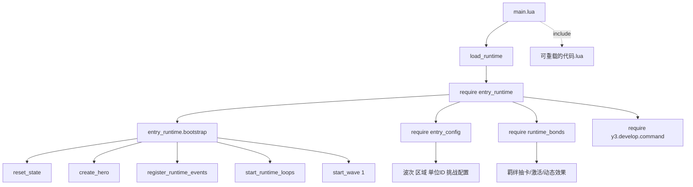
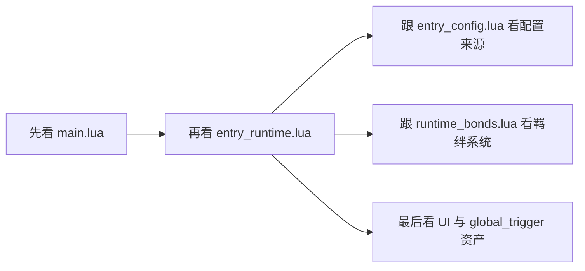

# 代码调用总览

## 1. 当前核心调用关系

当前地图脚本的真实调用关系可以概括为：

## 2. 各文件角色

### `main.lua`

作用很清晰，主要负责三件事：

- 根据调试模式设置日志输出级别
- 通过 `require 'entry_runtime'` 加载真正的运行时模块
- 在 `游戏-初始化` 与 `ltimer.wait(0)` 两处触发 `bootstrap_once()`

它本身更像“引导器”，不是完整玩法实现所在。

### `entry_runtime.lua`

这是当前地图的核心业务脚本，负责：

- 定义运行时 `STATE`
- 创建英雄
- 管理波次、Boss、挑战、资源、经验、结算
- 维护攻击技能槽、升级三选一、羁绊联动
- 创建 GM 面板和调试指令
- 启动循环与键盘事件

如果把这个地图看成一个程序，`entry_runtime.lua` 就是主系统层。

### `entry_config.lua`

负责提供结构化配置输入，主要包括：

- 玩家/敌方玩家 ID
- 英雄初始属性
- 主波次配置
- 挑战配置
- 出生点与区域
- 挑战次数恢复规则

它是运行时的“配置层”。

### `runtime_bonds.lua`

负责羁绊系统的模块化实现，包括：

- 羁绊运行时对象创建
- 羁绊卡池、权重、抽取
- 羁绊槽位、替换、吞噬
- 激活后的静态属性增益
- 动态效果刷新与击杀联动

这是 `entry_runtime.lua` 唯一明显拆分出来的业务子模块。

### `可重载的代码.lua`

当前只注册了一个 `R` 键示例打印，作用是演示：

- 如何用 `include` 接入热重载代码
- 如何通过 `.rd` 或 `y3.reload.reload()` 重载

它不是当前主玩法流程的一部分。

## 3. 当前没有承载主流程的代码入口

### `global_script/global_main.lua`

当前内容仅为注释 `--Hello, world!`，没有被主链路引用。

### 根目录 `global_trigger`

当前索引为空，没有承载项目级全局触发器逻辑。

### `maps/EntryMap/global_trigger`

这里不是空目录，而是地图内 UI 触发器资产，和 Lua 主逻辑并行存在，但不是本地图当前的第一入口。

## 4. 关于 `entry_runtime.lua` 中的“旧定义”

需要特别注意一个实现现状：

- `entry_runtime.lua` 内部保留了一套 `BOND_DEFS`、`BOND_CARD_DEFS` 与部分 `legacy_*` 函数
- 但当前实际羁绊系统主实现，是通过 `require 'runtime_bonds'` 后调用 `BondSystem.*`

因此理解项目时应以 `runtime_bonds.lua` 为羁绊系统主实现来源，`entry_runtime.lua` 内的同名常量更适合视为历史残留或局部兼容代码。

## 5. 推荐的代码阅读入口

这条路径最容易把“入口、配置、运行时、子系统、资源资产”分层看清。
