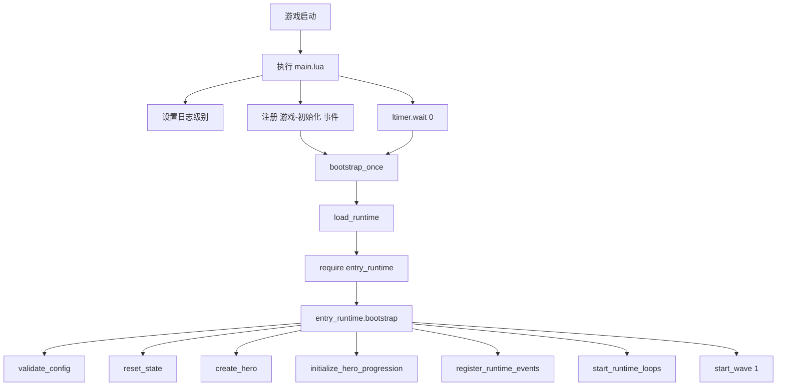

# 启动入口链路

## 1. 启动总览

当前地图启动链路由 `maps/EntryMap/script/main.lua` 发起，真正的运行时初始化发生在 `entry_runtime.lua` 的 `bootstrap()` 中。

主链路如下：

## 2. `main.lua` 做了什么

### 日志初始化

`main.lua` 会先判断是否处于调试模式：

- 调试模式：日志显示到游戏内，级别为 `debug`
- 非调试模式：不显示到游戏内，级别为 `info`

这一步只负责运行环境准备。

### 延迟加载运行时模块

`main.lua` 不会在文件顶层直接启动全部玩法，而是通过 `load_runtime()`：

- 只尝试加载一次 `entry_runtime`
- 用 `xpcall` 捕获 `require` 异常
- 校验返回模块中是否存在 `bootstrap` 函数

这保证了入口文件尽量轻，失败时也能打印清晰的引导日志。

### 双重触发 `bootstrap_once()`

`bootstrap_once()` 会在两处触发：

- `y3.game:event('游戏-初始化', ...)`
- `y3.ltimer.wait(0, ...)`

同时它内部用 `bootstrapped` 标记保证真正初始化只执行一次。这是一种比较稳妥的“防漏启动”写法。

## 3. `entry_runtime.bootstrap()` 做了什么

`bootstrap()` 是真正的游戏装配入口。

### 第一步：校验配置

调用 `validate_config()`，检查：

- 英雄单位物编是否存在
- 每波主怪与 Boss 单位物编是否存在
- 各挑战单位物编是否存在

如果配置缺失，主循环不会继续启动。

### 第二步：重置运行时

调用 `reset_state()`，初始化：

- `STATE.hero`
- `STATE.all_enemies`
- `STATE.active_wave`
- `STATE.active_challenges`
- `STATE.resources`
- `STATE.bond_runtime`
- `STATE.attack_skill_state`
- `STATE.skill_runtime`
- `STATE.challenge_charges`

这一步把整局游戏的运行态容器全部清空并重建。

### 第三步：创建英雄与成长状态

随后执行：

- `create_hero()`
- `initialize_hero_progression()`
- `setup_basic_attack_ability()`

也就是说，英雄对象与成长面板所依赖的基础数据，在启动阶段就会装配完成。

### 第四步：注册事件与调试能力

继续执行：

- `register_runtime_events()`
- `register_dev_commands()`

这一步会把键盘热键、升级事件、挑战事件、羁绊抽卡入口、调试命令等都挂起来。

### 第五步：开启循环并启动第一波

最后执行：

- `start_runtime_loops()`
- `ensure_gm_panel()`（调试模式）
- `y3.ltimer.wait(1, function() M.start_wave(1) end)`

至此地图进入可玩的主循环状态。

## 4. 为什么 `main.lua` 和 `entry_runtime.lua` 要分开

这种拆分有几个明显好处：

- `main.lua` 足够薄，启动职责单一
- `entry_runtime.lua` 可以被当成完整业务模块维护
- `require 'entry_runtime'` 失败时更容易定位问题
- 运行时状态可以集中在一个模块内封装

对后续扩展来说，这种结构比“所有逻辑堆在入口文件”更容易维护。

## 5. 入口层的边界

需要牢记以下边界：

- `main.lua` 是地图主入口
- `entry_runtime.lua` 是游戏主循环实现
- `entry_config.lua` 是配置输入
- `runtime_bonds.lua` 是羁绊子模块
- `可重载的代码.lua` 不是主入口，只是热重载示例入口
