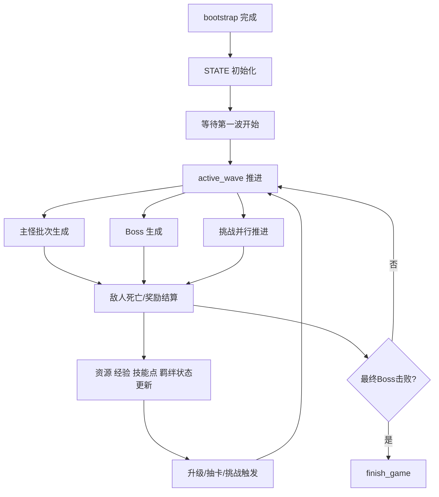

# 主循环与状态机

## 1. 运行时核心容器

当前地图最重要的运行时容器是 `entry_runtime.lua` 中的 `STATE`。它承载整局对战的主要状态，包括：

- 英雄对象与普攻对象
- 主线波次状态
- 挑战实例状态
- 敌人集合与敌人运行时信息
- 金币、木材、技能点
- 羁绊运行时
- 攻击技能槽运行时
- 调试面板状态
- 结算状态

可以把 `STATE` 理解为“本局游戏的总状态机”。

## 2. 主要状态分组

### 战场状态

- `hero`
- `all_enemies`
- `enemy_info_map`
- `total_enemy_alive`
- `defense_point`

### 主线推进状态

- `current_wave_index`
- `started_wave_count`
- `active_wave`
- `defeated_boss_waves`

### 挑战状态

- `active_challenges`
- `challenge_charges`
- `challenge_recover_elapsed`

### 成长状态

- `hero_progress`
- `skill_points`
- `awaiting_upgrade`
- `current_upgrade_choices`
- `attack_skill_state`
- `bond_runtime`

### 资源状态

- `resources.gold`
- `resources.wood`
- `resource_income_elapsed`

### 调试与收尾状态

- `gm_ui`
- `debug_ctrl_down_count`
- `game_finished`

## 3. 主循环由哪些定时器驱动

当前主循环不是单个大循环，而是多个定时器协作。

### 0.25 秒循环

`start_runtime_loops()` 中注册了一个 0.25 秒循环，负责推进大部分系统：

- `update_passive_resources(0.25)`
- `update_wave(0.25)`
- `update_challenges(0.25)`
- `update_challenge_charges(0.25)`
- `update_bond_effects(0.25)`
- `update_attack_skills(0.25)`

它相当于“主逻辑心跳”。

### 1 秒循环

另有一个 1 秒循环，负责处理 `skill_runtime` 中的轨道轰炸等周期性效果。

### 调试 UI 刷新循环

在调试模式下，还会额外有一个 0.25 秒循环刷新 GM 面板。

## 4. 主状态机如何推进

## 5. 敌人运行时信息为什么要单独建表

项目没有只依赖引擎中的“单位对象本身”，而是为敌人额外维护了 `enemy_info_map`，这样可以记录：

- 敌人属于主线还是挑战
- 敌人对应哪一波
- 是否为 Boss
- 是否为精英
- 击杀奖励
- 持有者实例

这样做的好处是：

- 结算逻辑不必反查大量外部上下文
- 羁绊、成长、挑战完成条件更容易判断
- 主线与挑战可以共用敌人生成逻辑

## 6. 状态机的终止条件

游戏结束由 `finish_game(is_win, reason)` 统一收口。

会触发结束的情况包括：

- 英雄死亡
- 最终波次 Boss 被击败并完成结算

结束后：

- `game_finished = true`
- 循环中的定时器会逐步停止
- 状态打印与消息输出进入结算态

## 7. 当前状态机设计特点

这套状态机的特点是“单文件集中调度 + 子系统模块化接入”：

- 波次、挑战、资源、技能、UI 都由 `entry_runtime.lua` 集中调度
- 羁绊系统通过 `runtime_bonds.lua` 模块化接入
- 运行态容器统一放在 `STATE`

对中小型地图来说，这种方式结构清晰，定位问题也比较快。
