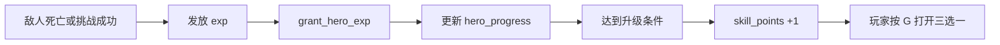

# 资源经验与结算

## 1. 资源体系概览

当前运行时资源主要有三类：

- 金币 `gold`
- 木材 `wood`
- 英雄经验/等级

它们都存放在 `STATE` 中，但来源不同：

- 金币、木材主要由击杀奖励、被动收入、羁绊奖励、挑战奖励产生
- 经验由击杀奖励和挑战奖励提供

## 2. 被动资源来源

`update_passive_resources(dt)` 会根据 `entry_config.lua` 中的 `resource_rules` 周期性增加资源：

- `gold_per_sec`
- `wood_per_sec`

这代表本项目不是完全依赖杀敌掉落，而是存在基础经济流入。

## 3. 击杀奖励如何结算

敌人死亡后，统一会进入敌人运行时信息的收口逻辑。这里会处理：

- 主怪/Boss/挑战奖励发放
- 羁绊击杀联动
- 额外金币奖励
- 医疗无人机等技能效果计数

奖励本身并不是直接写死在死亡事件里，而是来自：

- 波次配置中的 `main_kill_reward`
- 波次配置中的 `boss_kill_reward`
- 挑战配置中的 `reward`

## 4. 经验成长链路

经验成长大致如下：

项目还对英雄成长做了额外封装：

- 引擎等级上限以内，尽量同步引擎等级与经验
- 超过引擎经验上限后，用自定义成长规则继续推进

这说明作者已经在为“长线等级成长”做兼容。

## 5. 木材的主要用途

木材目前最明确的支出点是羁绊抽卡：

- 按 `F` 触发
- 消耗 100 木材
- 进入 3 选 1 羁绊卡流程

因此木材更像成长资源，而不是战斗即时消耗资源。

## 6. 挑战次数也是一种特殊资源

除了金币与木材，挑战次数 `challenge_charges` 也是受管理的资源：

- 初始次数来自 `challenge_rules.initial_charges`
- 最大上限来自 `challenge_rules.max_charges`
- 会按 `recover_sec` 自动恢复

它控制的是“挑战系统的进入资格”。

## 7. 胜负结算

`finish_game(is_win, reason)` 统一负责最终结算提示。

它会输出：

- 胜利或失败
- 原因说明
- 当前波次
- 金币与木材
- 英雄剩余生命

统一收口的好处是：

- 所有结束原因都能共用同一套结算文案
- 调试时更容易定位是在哪个条件下结束的

## 8. 结算触发条件

当前主要触发条件有：

- 英雄死亡 -> 失败
- 最终波次 Boss 击败并完成推进 -> 胜利

挑战失败不会直接结束整局，而只是结束该挑战实例。

## 9. 资源与结算的关系

可以把当前资源/结算逻辑总结为：

- 波次与挑战负责“产出机会”
- 敌人死亡负责“触发结算”
- 羁绊与技能负责“修正结算结果”
- 升级系统负责“把经验转成成长选择”
- `finish_game()` 负责“把过程收束成最终结果”

这构成了本地图从战斗到成长再到结算的闭环。
