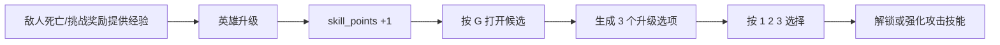

# 升级三选一系统

## 1. 系统定位

当前地图把升级收益转化成“技能点 + G 键三选一”的成长模式。

核心流程是：

## 2. 升级事件入口

`register_runtime_events()` 中监听了：

- `单位-升级`

当升级单位是当前英雄时，会：

- 同步英雄成长数据
- 增加 `STATE.skill_points`
- 提示玩家按 `G` 打开强化选择

因此“升级”本身并不直接把属性加到英雄身上，而是先变成一次决策机会。

## 3. 打开升级面板的方式

当前升级选择主要由键盘驱动：

- `G`：打开或继续当前三选一
- `1 / 2 / 3`：应用当前候选项

如果已经处于待选择状态，再按 `G` 不会刷新，而是继续展示当前那一轮候选。

## 4. 候选项如何生成

当前升级候选通过 `pick_upgrade_choices(count)` 生成。

其特点包括：

- 基于权重随机抽取
- 会考虑已经解锁的技能数量
- 会在连续多次未刷出新技能时提高“解锁型选项”出现机会
- 会记住上一次选择的技能，减少重复刷同系选项的概率

这说明系统并不是单纯“从大池子里随便抽 3 个”，而是做了成长节奏控制。

## 5. 升级项的两类本质

从当前实现看，升级项大致分两类：

### 解锁型

作用是给 2 到 4 号位解锁新的攻击技能。

### 强化型

作用是提升已有攻击技能的：

- 伤害
- 冷却
- 穿透
- 范围
- 弹射
- 重复次数

因此三选一系统本质上是“攻击技能系统的成长调度器”。

## 6. 选择结果如何落地

玩家按 `1 / 2 / 3` 后，`apply_upgrade(index)` 会：

- 取出当前候选
- 应用升级效果
- 记录最近一次选择的技能 ID
- 清空当前待选状态
- 刷新技能展示

如果选项是解锁型，还会把技能实例塞入空槽位。

## 7. 为什么这个系统重要

当前地图并没有把成长重心放在“大量数值天赋树”上，而是把一局内成长的核心决策，集中到了：

- 升级
- G 三选一
- 技能槽解锁/强化

这使得整局成长更容易围绕“武器构筑”展开，而不是只做被动数值堆叠。

## 8. 与其他系统的关系

三选一系统会与以下模块直接交互：

- 英雄经验系统：提供触发条件
- 攻击技能系统：提供被强化对象
- 羁绊系统：共同组成局内构筑
- UI/提示系统：负责告知当前候选与结果

因此它是“成长层”和“战斗层”之间最关键的桥。
