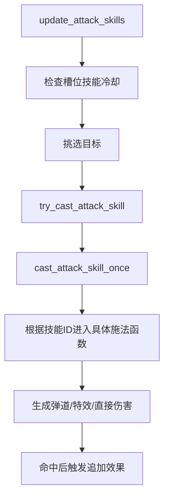

# 攻击技能系统

## 1. 系统定位

当前地图的“攻击技能系统”由 `entry_runtime.lua` 直接实现，核心定义是：

- `ATTACK_SKILL_DEFS`
- `ATTACK_SKILL_VFX`
- `attack_skill_state`

它不是传统“单位自带多个编辑器技能按钮”的纯物编实现，而是“Lua 管控的攻击技能槽系统”。

## 2. 当前内置的攻击技能

在 `ATTACK_SKILL_DEFS` 中，当前定义了以下技能：

- `basic_attack`：普攻
- `arcane_arrow`：奥术箭
- `flame_arrow`：爆炎箭
- `frost_arrow`：寒冰箭
- `thunder`：天雷

这些技能都带有自己的：

- 伤害类型
- 基础倍率
- 冷却
- 射程
- 穿透/爆炸/控制/弹射等附加参数

## 3. 技能槽结构

攻击技能运行时由 `create_attack_skill_state()` 生成，主要包含：

- 4 个槽位 `slots[1..4]`
- `by_id` 映射
- 升级次数记录
- 上次选择技能记录
- 新技能曝光保护计数

当前默认情况是：

- 1 号位为 `basic_attack`
- 2 到 4 号位初始为空

也就是说，非普攻技能需要通过成长系统逐步解锁。

## 4. 普攻为什么被单独绑定

当前英雄在创建后会：

- 读取并缓存 `hero:get_common_attack()`
- 通过 `sync_basic_attack_ability()` 同步普攻描述与射程
- 在 `施法-出手` 时刷新能力描述

这表示“普攻”虽然是引擎的普通攻击对象，但项目把它当成一个可升级、可显示说明、可被羁绊修正的技能槽来管理。

## 5. 技能执行流程

攻击技能的大致执行链路如下：

具体施法函数包括：

- `cast_arcane_arrow`
- `cast_flame_arrow`
- `cast_frost_arrow`
- `cast_thunder`

## 6. VFX 与弹道层

`ATTACK_SKILL_VFX` 提供了技能的表现层参数，包括：

- 投射物物编 ID
- 飞行速度
- 命中特效
- 爆炸特效
- 施法特效

运行时通过这些配置来调用：

- `play_particle_on_unit()`
- `play_particle_on_point()`
- `launch_projectile_to_target()`

因此技能数值与技能表现虽然写在同一文件，但在结构上已经分成了“逻辑参数”和“VFX 参数”两层。

## 7. 命中后的附加效果

技能命中后会继续与 `skill_runtime`、羁绊、敌人运行时信息联动，典型效果包括：

- 普攻额外追伤
- 溅射
- 连锁弹射
- 处决阈值击杀
- 首次命中 Boss/精英追加伤害
- 冰箭击退与控制
- 火箭爆炸
- 天雷额外打击

这说明攻击技能系统并不是孤立模块，而是成长系统的主要承载体。

## 8. 系统设计特点

当前攻击技能系统有几个明显特点：

- 技能由 Lua 控制，而不是完全由物编驱动
- 普攻也被纳入技能槽体系
- 数值、特效、成长强化在同一运行时汇合
- 与羁绊系统存在深度联动

如果后续要扩展新攻击技能，优先应该沿着这套“定义 + VFX + 槽位 + 升级入口”的模式继续扩展。
