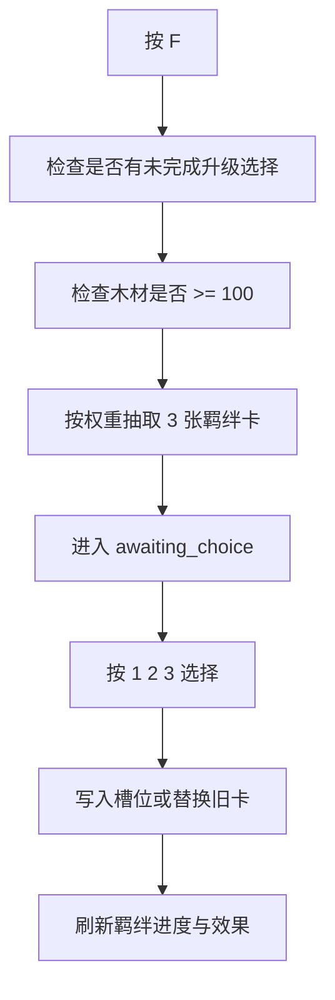

# 羁绊系统

## 1. 主实现文件

当前羁绊系统的主实现应以 `maps/EntryMap/script/runtime_bonds.lua` 为准。

`entry_runtime.lua` 虽然保留了 `BOND_DEFS`、`BOND_CARD_DEFS` 与多组 `legacy_*` 函数，但当前实际调用链已经切到：

- `BondSystem.create_runtime()`
- `BondSystem.refresh_effects()`
- `BondSystem.update_effects()`
- `BondSystem.try_draw()`
- `BondSystem.apply_choice()`
- `BondSystem.handle_enemy_kill()`

因此理解业务时，应把 `runtime_bonds.lua` 视为羁绊系统主实现来源。

## 2. 羁绊系统的核心结构

羁绊运行态由 `create_runtime()` 创建，内部主要包括：

- `slots`：当前持有并生效的羁绊卡槽
- `swallowed_card_ids`：被吞噬的旧卡
- `progress`：每个羁绊当前累计张数
- `active_bond_ids`：已经激活的羁绊
- `applied_attr_bonuses`
- `applied_runtime_bonuses`
- `dynamic_attr_bonuses`
- `dynamic_runtime_bonuses`
- `current_choices`
- `awaiting_choice`

这说明羁绊系统既管理“卡牌拥有关系”，也管理“效果生效状态”。

## 3. 羁绊卡与羁绊本体的区别

系统中有两层对象：

### 羁绊本体

例如：

- 祝福
- 狂战
- 猎手
- 贪欲
- 连射
- 连锁
- 奥术
- 处决
- 成长
- 坚壁

它定义：

- 名称
- 品质
- 激活所需张数
- 激活后的整套效果

### 羁绊卡

例如“圣水”“祈愿”“怒意”等单卡。

单卡本身会提供：

- 单卡属性加成
- 或单卡运行时加成

凑够同一羁绊的指定数量后，再额外激活整套效果。

## 4. 抽卡流程

当前羁绊抽卡入口是 `F` 键。

流程如下：

## 5. 槽位、替换与吞噬

当前最多保留 7 张生效羁绊卡。

当槽位未满时：

- 新卡直接进入 `slots`

当槽位已满时：

- 系统会自动评估要替换的旧卡
- 被替换卡进入 `swallowed_card_ids`

这意味着当前设计不是“无限收集”，而是“有限槽位构筑”。

## 6. 效果刷新机制

羁绊效果分两类：

### 静态效果

通过 `refresh_effects()` 重新计算并应用，例如：

- 最大生命
- 攻击速度
- 物理攻击
- 攻击范围

### 动态效果

通过 `update_effects(env, dt)` 每帧或每心跳推进，例如：

- 祝福定时回血与短时减伤
- 狂战低血量增益
- 奥术短时全伤害加成
- 坚壁高血减伤与低血回血

这也是为什么羁绊系统单独拆模块是合理的，因为它已经具备自己的状态机。

## 7. 与击杀系统的联动

`handle_enemy_kill()` 会处理一些击杀触发型羁绊，例如：

- 贪欲：累计击杀后发金币和木材
- 成长：累计击杀后永久加攻击、阶段性加伤害

这使羁绊不只是“静态被动条目”，还会参与资源与成长节奏。

## 8. 当前实现中的注意点

### 主实现归属

实际行为应以 `runtime_bonds.lua` 为准。

### `entry_runtime.lua` 中的旧羁绊常量

这些内容当前更适合理解为：

- 历史残留
- 兼容保留
- 局部展示逻辑依赖

不建议把它当作当前羁绊主系统的唯一真实来源。

## 9. 羁绊系统在整体玩法中的位置

本地图的局内构筑主要由两套系统共同组成：

- `G` 三选一：偏攻击技能构筑
- `F` 羁绊抽卡：偏属性与机制联动构筑

两者共享同一套战斗环境和运行态，因此羁绊系统是整个局内成长框架的另一半。
