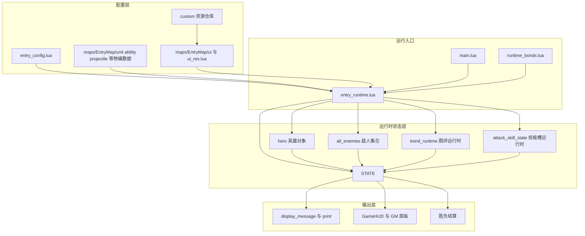

# 代码与数据流向

## 1. 总体思路

当前地图不是“脚本独立运行”，而是“脚本调度 + 物编对象 + UI 资产 + 自定义资源”协作运行。

最容易理解的方式，是按四层来看：

- 配置层
- 引擎对象层
- 运行时状态层
- UI 与输出层

## 2. 数据流总图



## 3. 配置层到运行时层

### `entry_config.lua`

负责把“应该怎么玩”输入给运行时，例如：

- 出生点
- 区域
- 波次
- 挑战
- 初始属性
- 资源规则

### 物编数据目录

负责提供“具体对象长什么样”，例如：

- 单位
- 投射物
- 技能
- 修饰器

Lua 提供 ID，引擎再去物编数据里解析实际对象。

## 4. 运行时层内部的数据流

当前主要流向是：

### 主线推进

`entry_runtime.lua` 根据 `entry_config.lua` 推进波次，生成敌人，并把敌人登记进 `STATE`。

### 战斗结算

英雄或技能命中敌人后，引擎对象产生伤害事件，Lua 再根据：

- 技能运行时
- 羁绊运行时
- 敌人运行时信息

继续做追加伤害、处决、奖励等结算。

### 成长回流

击杀和挑战产出的：

- 经验
- 金币
- 木材

又反过来驱动：

- `G` 三选一
- `F` 羁绊抽卡
- `Q/W/E/R` 挑战进入

这构成完整回路。

## 5. UI 与输出层的数据流

当前输出主要有两类：

### 文本输出

通过 `print()` 和 `display_message()` 直接向玩家或开发者提示：

- 波次开始
- 升级可选
- 挑战开始/结束
- 调试信息
- 结算结果

### UI 输出

通过 `GameHUD` 与静态 UI 资产展示：

- HUD
- 调试按钮
- 面板文本
- 其他编辑器 UI 资源

## 6. 当前最重要的数据闭环

本项目最核心的一条数据闭环是：

```text
entry_config.lua 提供波次/挑战规则
-> entry_runtime.lua 生成敌人与推进状态
-> 敌人死亡产生资源与经验
-> 资源驱动羁绊抽卡，经验驱动升级三选一
-> 成长结果反过来增强技能与羁绊效果
-> 更强的战斗能力继续作用于后续波次与挑战
```

这就是当前塔防地图的主数据循环。
