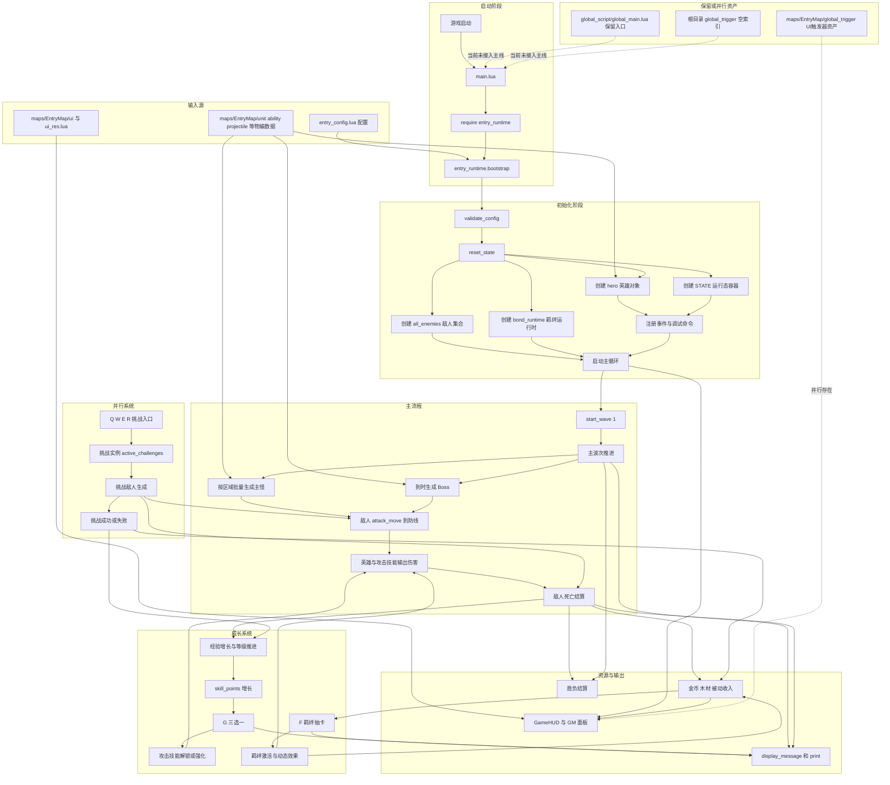

# 整体游戏流程图

## 1. 说明

这张图只画当前仓库里“真实执行的游戏主流程”，不把保留入口画成主线节点。

图中重点标出：

- 地图启动
- 运行时初始化
- 主波次推进
- 挑战并行
- 成长与羁绊
- 资源变化
- 胜负结算
- UI 展示
- 地图数据输入

## 2. Mermaid 总流程图

## 3. 图的阅读重点

这张图最重要的阅读结论有三个：

1. 主入口是 `main.lua -> entry_runtime.bootstrap()`，不是 `global_script/global_main.lua`。
2. 主战斗闭环是“波次/挑战 -> 击杀 -> 资源与经验 -> 升级/羁绊 -> 更强战斗力 -> 下一轮波次”。
3. UI、地图物编数据、地图内触发器资产都很重要，但它们不等于当前 Lua 主循环本身。
