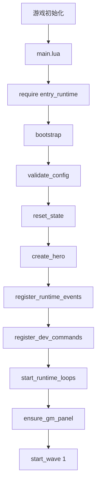
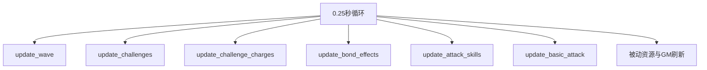
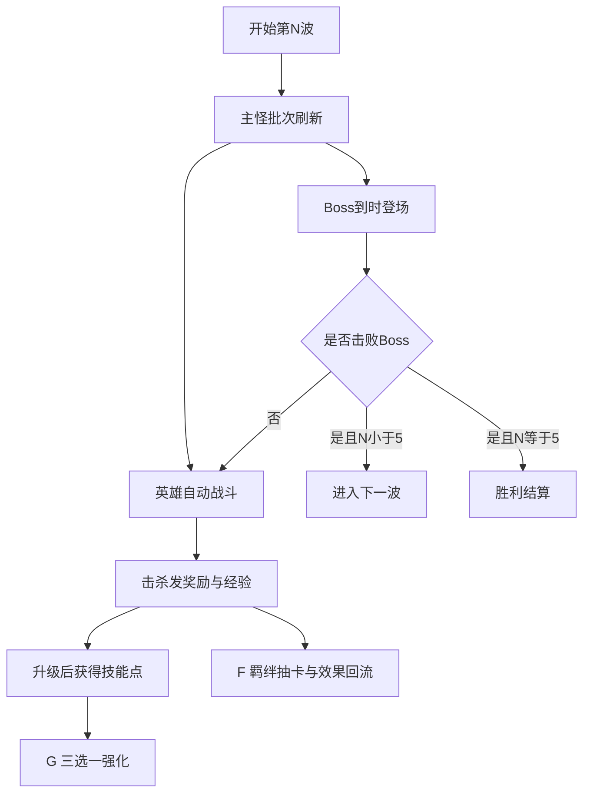
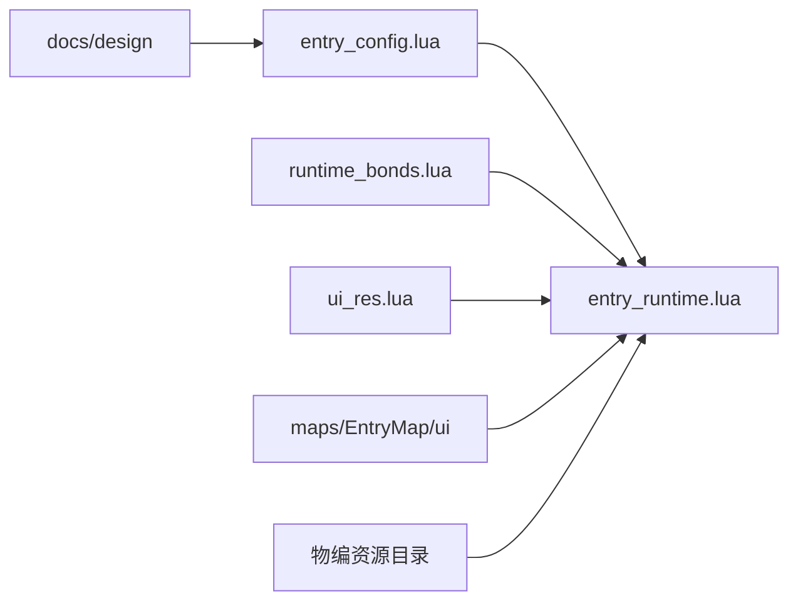

# 整体游戏流程图

## 模块职责

用 agent 可执行视角展示启动链路、单局循环和模块关系。

## Source Of Truth

- 启动与循环：`maps/EntryMap/script/main.lua`、`maps/EntryMap/script/entry_runtime.lua`
- 配置与系统分层：`maps/EntryMap/script/entry_config.lua`、`maps/EntryMap/script/runtime_bonds.lua`

## 关键状态与数据流

- 启动流：`main.lua -> entry_runtime.bootstrap()`
- 主循环流：`STATE + timer update`
- 成长回流：击杀奖励 -> 经验/资源 -> `G/F` -> 战斗力回写
- 系统分层流：设计 -> 配置 -> 运行时 -> UI/资源

## 启动链路

## 单局主循环

## 单局推进

## 模块关系

## 阅读重点

- 看主循环先读 `entry_runtime.lua`
- 看配置先读 `entry_config.lua`
- 看 `F` 系统先读 `runtime_bonds.lua`
- 看未来规划与缺口，回到 `maps/EntryMap/script/docs/项目模块/07-实现状态与路线图/实现状态与路线图.md`

## 当前已实现行为

- 启动链路、5 波主线、G/F/挑战并行和基础结算都已经能在图中对应到真实代码

## 未实现或占位项

- 图中没有展开成长武器、宝物、烙印、奖励队列，因为这些尚未正式进入运行时

## Agent 修改建议与风险点

- 流程图只用于快速建立心智模型，具体字段和状态仍以代码与模块文档为准
